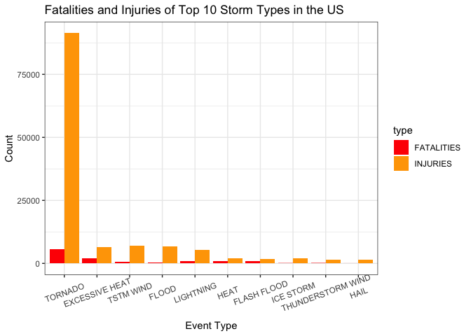
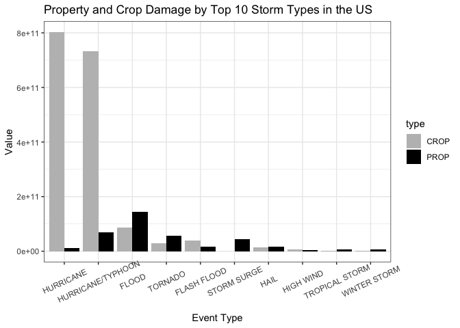

### Synopsis

Storms and other severe weather events can cause both public health and economic problems for communities and municipalities. Many severe events can result in fatalities, injuries, and property damage, and preventing such outcomes to the extent possible is a key concern.

This project involves exploring the U.S. National Oceanic and Atmospheric Administration's (NOAA) storm database. This database tracks characteristics of major storms and weather events in the United States, including when and where they occur, as well as estimates of any fatalities, injuries, and property damage.

### Data Processing


```r
if (!file.exists("storm.csv.bz2")) {
    url <- "https://d396qusza40orc.cloudfront.net/repdata%2Fdata%2FStormData.csv.bz2"
    download.file(url, "storm.csv.bz2")
}

storm <- read.csv("storm.csv.bz2")
```


```r
colnames(storm)
```

```
##  [1] "STATE__"    "BGN_DATE"   "BGN_TIME"   "TIME_ZONE"  "COUNTY"    
##  [6] "COUNTYNAME" "STATE"      "EVTYPE"     "BGN_RANGE"  "BGN_AZI"   
## [11] "BGN_LOCATI" "END_DATE"   "END_TIME"   "COUNTY_END" "COUNTYENDN"
## [16] "END_RANGE"  "END_AZI"    "END_LOCATI" "LENGTH"     "WIDTH"     
## [21] "F"          "MAG"        "FATALITIES" "INJURIES"   "PROPDMG"   
## [26] "PROPDMGEXP" "CROPDMG"    "CROPDMGEXP" "WFO"        "STATEOFFIC"
## [31] "ZONENAMES"  "LATITUDE"   "LONGITUDE"  "LATITUDE_E" "LONGITUDE_"
## [36] "REMARKS"    "REFNUM"
```

`FATALITIES` and `INJURIES` are variables related to population health.

Sum all injuries and fatalities by event type and keep top 10 most harmful event types stored in new data frame `health`. Convert to long format for plotting.


```r
inj_by_type <- aggregate(INJURIES ~ EVTYPE, data = storm, sum)
fatal_by_type <- aggregate(FATALITIES ~ EVTYPE, data = storm, sum)

health <- 
  merge(inj_by_type, fatal_by_type, by = "EVTYPE") |>
  arrange(desc(INJURIES), desc(FATALITIES)) |>
  slice(1:10)

health
```

```
##               EVTYPE INJURIES FATALITIES
## 1            TORNADO    91346       5633
## 2          TSTM WIND     6957        504
## 3              FLOOD     6789        470
## 4     EXCESSIVE HEAT     6525       1903
## 5          LIGHTNING     5230        816
## 6               HEAT     2100        937
## 7          ICE STORM     1975         89
## 8        FLASH FLOOD     1777        978
## 9  THUNDERSTORM WIND     1488        133
## 10              HAIL     1361         15
```

```r
health_long <- health |>
  pivot_longer(cols = c(INJURIES, FATALITIES), names_to = "type", values_to = "count")
```

`PROPDMG`, `PROPDMGEXP`, `CROPDMG` and `CROPDMGEXP` are variables related to economy.


```r
unique(storm$PROPDMGEXP)
```

```
##  [1] "K" "M" ""  "B" "m" "+" "0" "5" "6" "?" "4" "2" "3" "h" "7" "H" "-" "1" "8"
```


```r
unique(storm$CROPDMGEXP)
```

```
## [1] ""  "M" "K" "m" "B" "?" "0" "k" "2"
```

Function to convert `H/h` to 100, `K/k` to 1,000, `M/m` to 1,000,000 etc, everything else gets converted to 0 for simplicity (not mentioned in Storm Data Preparation doc)


```r
char_to_num <- function(char) {
  if (char == "h" || char == "H")
    return(1E2)
  else if (char == "k" || char == "K")
    return(1E3)
  else if (char == "m" || char == "M")
    return(1E6)
  else if (char == "b" || char == "B")
    return(1E9)
  else
    return(0)
}
```

Creating two new columns `PROP` and `CROP` by multiplying number column `PROPDMG` with transformed magnitude column `PROPDMGEXP` and `CROPDMG` with `CROPDMGEXP`


```r
storm$PROP <- storm$PROPDMG * sapply(storm$PROPDMGEXP, char_to_num)
storm$CROP <- storm$CROPDMG * sapply(storm$PROPDMGEXP, char_to_num)
```

Sum all property damage values and crop damage values by event type and keep top 10 most harmful event types stored in new data frame `econ`. Convert to long format for plotting.


```r
prop_by_type <- aggregate(PROP ~ EVTYPE, data = storm, sum)
crop_by_type <- aggregate(CROP ~ EVTYPE, data = storm, sum)


econ <- 
  merge(prop_by_type, crop_by_type, by = "EVTYPE") |>
  arrange(desc(PROP), desc(CROP)) |>
  slice(1:10)

econ
```

```
##               EVTYPE         PROP         CROP
## 1              FLOOD 144657709800  87251972270
## 2  HURRICANE/TYPHOON  69305840000 732768451330
## 3            TORNADO  56937160480  28269872180
## 4        STORM SURGE  43323536000      5000000
## 5        FLASH FLOOD  16140811510  38822136880
## 6               HAIL  15732267220  15314162250
## 7          HURRICANE  11868319010 802881916000
## 8     TROPICAL STORM   7703890550   1943517700
## 9       WINTER STORM   6688497250    688059000
## 10         HIGH WIND   5270046260   7174065610
```

```r
econ_long <- econ |>
  pivot_longer(cols = c(PROP, CROP), names_to = "type", values_to = "value")
```

### Results


```r
ggplot(data = health_long, aes(x = reorder(EVTYPE, -count), y = count, fill = type)) +
  geom_bar(stat = "identity", position = "dodge") +
  scale_fill_manual(values = c("INJURIES" = "orange", "FATALITIES" = "red")) + 
  labs(x="Event Type", y="Count") +
  ggtitle("Fatalities and Injuries of Top 10 Storm Types in the US") +
  theme_bw() +
  theme(axis.text.x = element_text(angle = 20, vjust = 0.7),
        legend.position = "right")
```

<!-- -->

Across the United States, **Tornadoes** are most harmful with respect to population health.


```r
ggplot(data = econ_long, aes(x = reorder(EVTYPE, -value), y = value, fill = type)) +
  geom_bar(stat = "identity", position = "dodge") +
  scale_fill_manual(values = c("PROP" = "black", "CROP" = "gray")) + 
  labs(x="Event Type", y="Value") +
  ggtitle("Property and Crop Damage by Top 10 Storm Types in the US") +
  theme_bw() +
  theme(axis.text.x = element_text(angle = 25, vjust = 0.7),
        legend.position = "right")
```

<!-- -->

Across the United States, **Hurricanes** have the greatest economic consequences.
